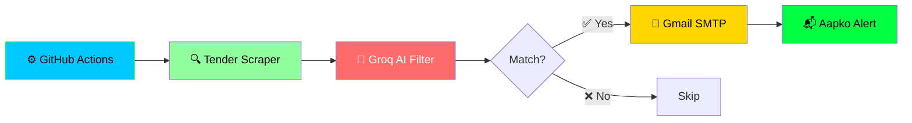

# IT-buyer-Finder
<div align="center">

<!-- HACKER STYLE ANIMATED HEADER -->


<!-- HACKER TERMINAL ANIMATION -->
<a href="https://git.io/typing-svg">
  
</a>

<br/><br/>

<!-- BADGES -->


<br/>


</div>

---

<div align="center">

## 🎯 Kya Karta Hai Yeh Tool?

</div>

<table align="center">
<tr>
<td align="center" width="25%">
<br/>
<b>🔍 Scan</b><br/>
<sub>Government tenders<br/>automatically scan</sub>
</td>
<td align="center" width="25%">
<br/>
<b>🧠 AI Filter</b><br/>
<sub>Groq AI se<br/>smart matching</sub>
</td>
<td align="center" width="25%">
<br/>
<b>📧 Notify</b><br/>
<sub>Instant email<br/>alerts</sub>
</td>
<td align="center" width="25%">
<br/>
<b>🚀 Reach</b><br/>
<sub>Turant buyer<br/>se connect</sub>
</td>
</tr>
</table>

---

<div align="center">

## 💼 Companies Ke Liye Fayde

</div>

| Feature | Aapke Liye Fayda |
|---------|------------------|
| ⚡ **Real-Time Alerts** | Naya tender aate hi turant pata chalta hai |
| 🎯 **AI Filtering** | Sirf relevant tenders, spam nahi |
| ⏰ **24/7 Automation** | Roz 2 baar automatically chalta hai |
| 📧 **Email Notification** | Seedha inbox mein alert |
| 🆓 **100% Free** | Koi subscription nahi |
| 🔓 **Open Source** | MIT License — free to modify |

---

<div align="center">

## 🚀 Kaise Use Karein

</div>

```bash
# Step 1: Repo fork karo

# Step 2: Secrets add karo (Settings → Secrets → Actions)
GROQ_API_KEY        → console.groq.com se
GMAIL_APP_PASSWORD  → Google App Password (16 characters)
NOTIFY_EMAIL        → aapka email

# Step 3: Keywords daalo
config/keywords.txt → "firewall, laptop, server, Faridabad"

# Step 4: Actions tab → "IT Tender Monitor" → Run workflow

# Step 5: Bas! Email alerts aane lagenge 🎉
```

---

<div align="center">

## 🔑 API Keys Kaise Lein

</div>

<details>
<summary><b>🔐 Groq API Key (Free AI)</b></summary>

1. `console.groq.com` par jao
2. Google se sign up karo
3. **API Keys → Create API Key**
4. Key copy karo (`gsk_` se shuru)

</details>

<details>
<summary><b>📧 Gmail App Password (Free Email)</b></summary>

1. Google Account → **Security**
2. **2-Step Verification** ON karo
3. `myaccount.google.com/apppasswords` par jao
4. App name: `IT Buyer Finder`
5. **Generate** dabao
6. 16-character password copy karo

</details>

---

<div align="center">

## 🛠️ Tech Stack


</div>

---

<div align="center">

## 📊 Workflow Diagram

</div>



---

<div align="center">

## 📸 Screenshots

### 🖥️ Live Demo


### 📧 Email Alert


</div>

---

<div align="center">

## ⚠️ Important Note

**GitHub Actions se CPWD block ho sakta hai (403 Forbidden).**

Is case mein:
- 💻 **Local computer par chalao** — aapka home IP block nahi hoga
- 🌐 **Ya proxy/paid API use karo** — Apify jaise services

</div>

---

<div align="center">

## 📄 License

MIT License - Free to use, modify, and distribute

</div>

---

<!-- ==================== MADE BY KULDEEP - HACKER STYLE ==================== -->

<div align="center">


<br/>

<!-- HACKER TYPING ANIMATION -->
<a href="https://git.io/typing-svg">
  
</a>

<br/><br/>

<!-- BADGES -->


<br/><br/>

<!-- SOCIAL LINKS -->
<a href="https://github.com/KuldeepLinux">
  
</a>
<a href="https://linkedin.com/in/kuldeep">
  
</a>

<br/><br/>

<!-- ANIMATED LINE -->


<br/>

<!-- HACKER QUOTE -->
<i>"The quieter you become, the more you are able to hear."</i>
<br/>
<b>— Kali Linux</b>

<br/><br/>

<!-- STATS -->


<br/><br/>

<!-- FOOTER WAVE -->


</div>
